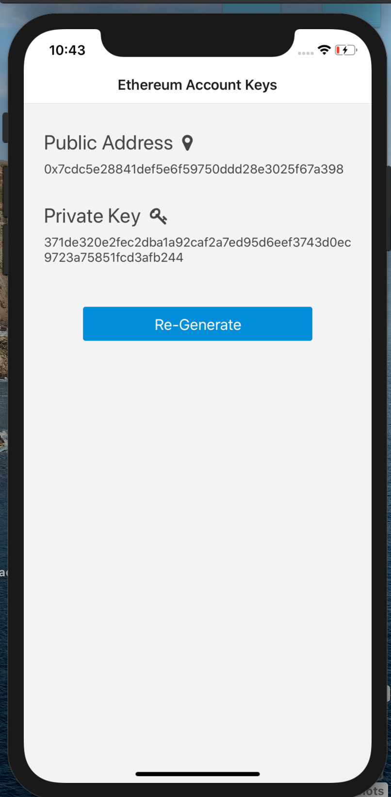
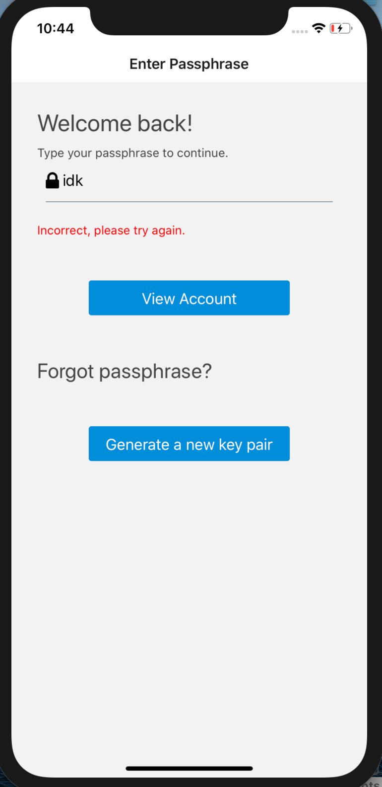

# Ethereum Wallet
A very primitive implementation of a non-custodial Ethereum wallet.

## Environment
* Node 10.15.1
* NPM 6.4.1
* Xcode 11.5

## Libraries Used for Key Generation
* https://github.com/ConsenSys/eth-lightwallet
* https://github.com/bitcoinjs/bip39

## File Structure

A lot of it is boilerplate included in the template that React Native starts you off with. These are the notable files/folders.

`index.js` Entry file

`screens/` Top-level components used for navigation. Each component has it's own folder with a `index.js` being the stateful container and `presentation.js` being the dumb component.

`utils/`, Provides utility functions, mainly for storage

`vendor/`, Holds the distributable package files that i had to browserify in order to run on react native

## Entropy
This project uses `bip39.generateMnemonic()` to produce 128-bits of entropy. It is not an ideal approach for a secure and production-ready wallet. To improve our seed entropy, we would need to replace that method with either
1. using random user input such as mouse movement or key strokes
2. a system entropy generator like /dev/urandom
3. or both

